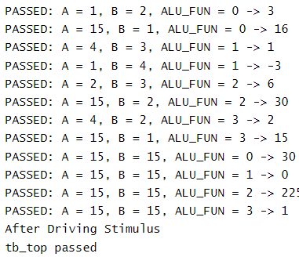

# ALU Design and Verification Using Cocotb

`Submitted by:` Amr Hossam

## Overview

This document provides an overview of the design and verification of an Arithmetic Logic Unit (ALU) using CoCotb. The verification process includes are based on the verification plan used before. The results from these tests are compared against a golden reference.

## Design Description

The ALU design is implemented in Verilog and includes the following features:
- **Inputs:** 
  - `A`: 4-bit operand
  - `B`: 4-bit operand
  - `ALU_FUN`: 2-bit function select signal
  - `CLK`: Clock signal
- **Output:** 
  - `ALU_OUT`: 8-bit result of the ALU operation

The ALU supports four operations based on the `ALU_FUN` input:
- `2'b00`: Addition (`ALU_OUT = A + B`)
- `2'b01`: Subtraction (`ALU_OUT = A - B`)
- `2'b10`: Multiplication (`ALU_OUT = A * B`)
- `2'b11`: Division (`ALU_OUT = A / B`)

## Verification Methodology

Tests were conducted by entering predefined inputs into the ALU and observing the output. The results were then compared to the expected values to validate correctness.

**Verification Plan and Results:**
  

## Comparison with Golden Reference

The outputs were compared to a golden reference. This comparison helps ensure that the ALU operates as expected and meets the design specifications.

