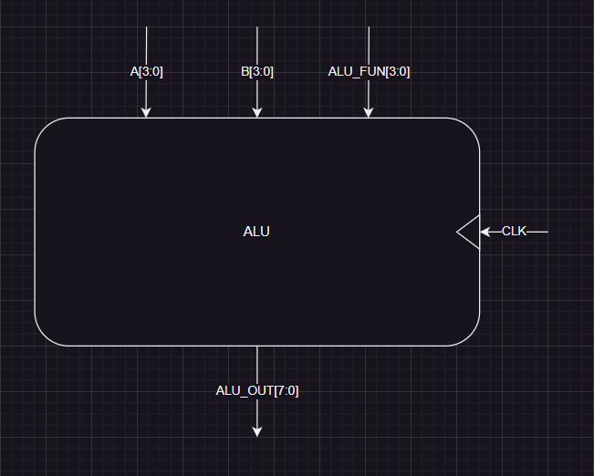

# Verification Plan for ALU

---

- **Inputs**:
  - `A` (4-bit input)
  - `B` (4-bit input)
  - `ALU_FUN` (2-bit control signal)
  - `CLK` (clock)
- **Output**:
  - `ALU_OUT` (8-bit result of ALU operation)
  
- **ALU Operations**:
  - `ALU_FUN = 2'b00`: Addition (`ALU_OUT = A + B`)
  - `ALU_FUN = 2'b01`: Subtraction (`ALU_OUT = A - B`)
  - `ALU_FUN = 2'b10`: Multiplication (`ALU_OUT = A * B`)
  - `ALU_FUN = 2'b11`: Division (`ALU_OUT = A / B`)

---

### **Test Scenarios**

- **Addition**: Test multiple combinations of `A` and `B` with `ALU_FUN = 2'b00`. 
  - Case 1: `A = 4'b0001`, `B = 4'b0010` (1 + 2 = 3)
  - Case 2: `A = 4'b1111`, `B = 4'b0001` (15 + 1 = 16)
  
- **Subtraction**: Test multiple combinations of `A` and `B` with `ALU_FUN = 2'b01`.
  - Case 1: `A = 4'b0100`, `B = 4'b0011` (4 - 3 = 1)
  - Case 2: `A = 4'b0001`, `B = 4'b0100` (1 - 4 = -3)
  
- **Multiplication**: Test multiple combinations of `A` and `B` with `ALU_FUN = 2'b10`.
  - Case 1: `A = 4'b0010`, `B = 4'b0011` (2 * 3 = 6)
  - Case 2: `A = 4'b1111`, `B = 4'b0010` (15 * 2 = 30)
  
- **Division**: Test multiple combinations of `A` and `B` with `ALU_FUN = 2'b11`.
  - Case 1: `A = 4'b0100`, `B = 4'b0010` (4 / 2 = 2)
  - Case 2: `A = 4'b1111`, `B = 4'b0001` (15 / 1 = 15)
  
- **Maximum Values**: Check operations with the largest values of `A` and `B` (e.g., `A = 4'b1111`, `B = 4'b1111`).
- **Zero Values**: Test with `A` or `B` being `0` to check behavior during operations like addition, subtraction, multiplication, and division.

---