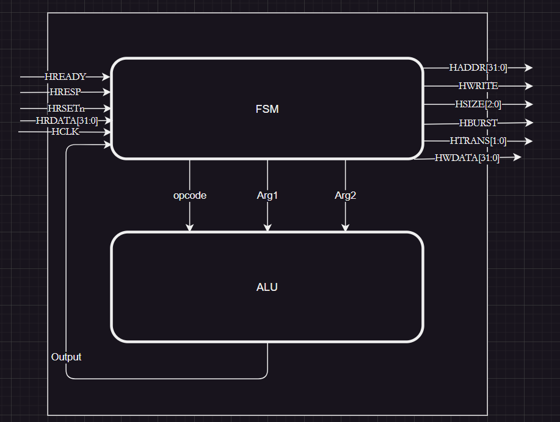
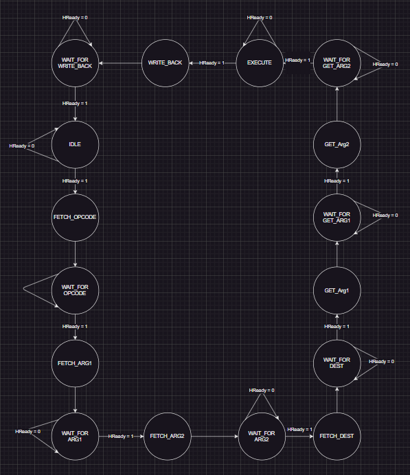
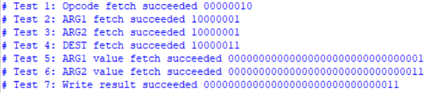

# AMBA Bus Documentation

## Table of Contents
1. [Introduction](#introduction)
2. [System Overview](#system-overview)
3. [Supported Features](#supported-features)
4. [Block Diagram](#block-diagram)
5. [Finite State Machine (FSM)](#finite-state-machine-fsm)
6. [Testing](#testing)
7. [System Code](#system-code) 
8. [Next Mile Stones](#next-mile-stones)

## Introduction
Submitted by: Amr Hossam \
GitHub Repo: https://github.com/amrhossam9/ADI_Assignments

This document provides a detailed overview of milestone 1 to build a system transfers data and instructions between the ALU and memory components using the AMBA protocol.


## System Overview
The system integrates an ALU (master) with ROM and RAM (slaves) through the AMBA bus protocol. 


## Supported Features
- Support for SEQ (Sequential) and NONSEQ (Non-Sequential) transfers
- The bus supports both burst INCR (Incremental) and single transfer
    - INCR is used for transferring instructions
    - Single transfer is used for reading and writing values

## Block Diagram


### Signal Descriptions

#### Input Signals
| Signal         | Function                                               |
| -------------- | ------------------------------------------------------ |
| `HREADY`       | Indicates the slave's readiness to accept new data. |
| `HRESP`        | High for an error response, low for a successful transfer. |
| `HRESETn`      | Reset signal for initializing the module.  |
| `HCLK`         | Clock signal driving the module.       |
| `HRDATA[31:0]` | Data read from the bus.         |


#### Output Signals
| Signal         | Function                                               |
| -------------- | ------------------------------------------------------ |
| `HADDR[31:0]`  | Address for memory operations.      |
| `HWRITE`       | High for write operations, low for read operations. |
| `HSIZE[2:0]`   | Size of the data transfer.         |
| `HBURST`       | Burst type indicator (single or incremental). |
| `HTRANS[1:0]`  | Transfer type (idle, busy, non-sequential, sequential). |
| `HWDATA[31:0]` | Data to be written to the bus.                    |

## Finite State Machine (FSM)



### Functional Overview
- **IDLE:** Initializes registers and checks if the bus is ready for a new operation.
- **FETCH and WAIT States:** Handle the retrieval of instructions and data from ROM and RAM, ensuring synchronization with the bus readiness signal.
- **EXECUTE and WRITE_BACK:** Manage the execution of operations and the storage of results back to the designated memory location.


## Testing
The bus was tested by receiving an instruction, requesting an instruction, and successfully performing operations involving two values from RAM using the ALU. The results were then sent back to RAM.



## System Code

### File: `FSM.sv`
```
module FSM (
    input wire        HREADY, HRESP, 
    input wire        HRESTn, HCLK,
    input wire [31:0] HRDATA, ALU_OUTPUT,
    output reg [31:0] HADDR, HWDATA,
    output reg        HWRITE, HBURST,
    output reg [2:0]  HSIZE, 
    output reg [1:0]  HTRANS,
    output reg [7:0]  opcode,
    output reg [31:0] Arg1, Arg2
);

    typedef enum bit [4:0] {
        IDLE         = 5'b00000,
        ROM_Address  = 5'b00001,
        FETCH_OPCODE = 5'b00010,
        FETCH_ARG1   = 5'b00011,
        FETCH_ARG2   = 5'b00100,
        FETCH_DEST   = 5'b00101,
        GET_Arg1     = 5'b00110,
        GET_Arg2     = 5'b00111,
        EXECUTE      = 5'b01000,
        WRITE_BACK   = 5'b01001,
        WAIT_FOR_OPCODE = 5'b01010,
        WAIT_FOR_ARG1 = 5'b01011,
        WAIT_FOR_ARG2 = 5'b01100,
        WAIT_FOR_DEST = 5'b01101,
        WAIT_FOR_GET_ARG1 = 5'b01110,
        WAIT_FOR_GET_ARG2 = 5'b01111,
        WAIT_FOR_WRITE_BACK = 5'b10000
    } states;


    states PS, NS;

    typedef enum bit [2:0] {
        HSIZE_Byte = 3'b000,
        HSIZE_one_word = 3'b010
    } HSIZE_STATES;

    typedef enum bit [1:0] {
        HTRANS_IDLE = 2'b00,
        HTRANS_BUSY = 2'b01,
        HTRANS_NONSEQ = 2'b10,
        HTRANS_SEQ = 2'b11
    } HTRANS_STATES;

    typedef enum bit {
        HBURST_state_single = 0,
        HBURST_state_INCR = 1
    } HBURST_STATES;

    reg [7:0] inst_counter;
    reg [7:0] DEST, Arg_A, Arg_B;

    always @(posedge HCLK or negedge HRESTn) 
    begin
        if (!HRESTn)
        begin
            PS <= IDLE;
            inst_counter <= 0;
        end
        else
            PS <= NS;
    end

    always @(*) 
    begin
        case (PS) 
            IDLE: 
            begin
                HADDR <= 0;
                HWDATA <= 0;
                HWRITE <= 1'b0;
                HBURST <= HBURST_state_single;
                HSIZE <= 3'b000; 
                HTRANS <= HTRANS_IDLE; 
                opcode <=  0;
                Arg1 <= 0;
                Arg2 <= 0;
                if (HREADY)
                begin
                    NS <= FETCH_OPCODE;
                end
                else
                    NS <= IDLE;
            end

            FETCH_OPCODE:
            begin
                HADDR <= inst_counter;    // Set address for opcode
                HWRITE <= 0;              // Read operation
                HSIZE <= HSIZE_Byte;      // Byte-sized transfer
                HBURST <= HBURST_state_INCR;
                HTRANS <= HTRANS_NONSEQ;  // Non-sequential transfer
                
                NS <= WAIT_FOR_OPCODE;     // Move to next state to wait for HREADY
            end

            WAIT_FOR_OPCODE:
            begin
                if (HREADY)               // Wait for HREADY to go HIGH
                begin
                    opcode <= HRDATA[7:0]; // Capture opcode from HRDATA
                    NS <= FETCH_ARG1;      // Move to the next state
                end
                else
                begin
                    NS <= WAIT_FOR_OPCODE;  // Stay in this state until HREADY is HIGH
                end
            end

            FETCH_ARG1:
            begin
                HADDR <= inst_counter + 8'b1;  // Set address for Arg1
                HWRITE <= 0;                   // Read operation
                HSIZE <= HSIZE_Byte;            // Byte-sized transfer
                HBURST <= HBURST_state_INCR;
                HTRANS <= HTRANS_SEQ;           // Sequential transfer
                NS <= WAIT_FOR_ARG1;            // Wait for HREADY
            end

            WAIT_FOR_ARG1:
            begin
                if (HREADY)
                begin
                    Arg_A <= HRDATA[7:0];       // Capture Arg1
                    NS <= FETCH_ARG2;           // Move to next state
                end
                else
                begin
                    NS <= WAIT_FOR_ARG1;        // Stay in this state until HREADY is HIGH
                end
            end

            FETCH_ARG2:
            begin
                HADDR <= inst_counter + 8'b10;  // Set address for Arg2
                HWRITE <= 0;                    // Read operation
                HSIZE <= HSIZE_Byte;            // Byte-sized transfer
                HBURST <= HBURST_state_INCR;
                HTRANS <= HTRANS_SEQ;           // Sequential transfer
                NS <= WAIT_FOR_ARG2;            // Wait for HREADY
            end

            WAIT_FOR_ARG2:
            begin
                if (HREADY)
                begin
                    Arg_B <= HRDATA[7:0];       // Capture Arg2
                    NS <= FETCH_DEST;           // Move to next state
                end
                else
                begin
                    NS <= WAIT_FOR_ARG2;        // Stay in this state until HREADY is HIGH
                end
            end

            FETCH_DEST:
            begin
                HADDR <= inst_counter + 8'b11;  // Set address for destination
                HWRITE <= 0;                    // Read operation
                HSIZE <= HSIZE_Byte;            // Byte-sized transfer
                HBURST <= HBURST_state_INCR;
                HTRANS <= HTRANS_SEQ;           // Sequential transfer
                NS <= WAIT_FOR_DEST;            // Wait for HREADY
            end

            WAIT_FOR_DEST:
            begin
                if (HREADY)
                begin
                    DEST <= HRDATA[7:0];        // Capture destination address
                    NS <= GET_Arg1;             // Move to next state
                end
                else
                begin
                    NS <= WAIT_FOR_DEST;        // Stay in this state until HREADY is HIGH
                end
            end

            GET_Arg1:
            begin
                HADDR <= Arg_A;                 // Set address for Arg1
                HWRITE <= 0;                    // Read operation
                HSIZE <= HSIZE_one_word;        // Word-sized transfer
                HBURST <= HBURST_state_single;
                HTRANS <= HTRANS_NONSEQ;        // Non-sequential transfer
                NS <= WAIT_FOR_GET_ARG1;        // Wait for HREADY
            end

            WAIT_FOR_GET_ARG1:
            begin
                if (HREADY)
                begin
                    Arg1 <= HRDATA[31:0];       // Capture full word for Arg1
                    NS <= GET_Arg2;             // Move to next state
                end
                else
                begin
                    NS <= WAIT_FOR_GET_ARG1;    // Stay in this state until HREADY is HIGH
                end
            end

            GET_Arg2:
            begin
                HADDR <= Arg_B;                 // Set address for Arg2
                HWRITE <= 0;                    // Read operation
                HSIZE <= HSIZE_one_word;        // Word-sized transfer
                HBURST <= HBURST_state_single;
                HTRANS <= HTRANS_NONSEQ;        // Non-sequential transfer
                NS <= WAIT_FOR_GET_ARG2;        // Wait for HREADY
            end

            WAIT_FOR_GET_ARG2:
            begin
                if (HREADY)
                begin
                    Arg2 <= HRDATA[31:0];       // Capture full word for Arg2
                    NS <= EXECUTE;              // Move to next state
                end
                else
                begin
                    NS <= WAIT_FOR_GET_ARG2;    // Stay in this state until HREADY is HIGH
                end
            end

            EXECUTE:
            begin
                if (HREADY)
                    NS <= WRITE_BACK;           // Proceed to WRITE_BACK when ready
                else
                    NS <= EXECUTE;              // Stay in EXECUTE until HREADY is HIGH
            end

            WRITE_BACK:
            begin
                HADDR <= DEST;                  // Set destination address
                HWRITE <= 1;                    // Write operation
                HSIZE <= HSIZE_one_word;        // Word-sized transfer
                HBURST <= HBURST_state_single;
                HTRANS <= HTRANS_NONSEQ;        // Non-sequential transfer
                HWDATA <= ALU_OUTPUT;           // Write ALU result
                NS <= WAIT_FOR_WRITE_BACK;      // Wait for HREADY
            end

            WAIT_FOR_WRITE_BACK:
            begin
                if (HREADY)
                begin
                    NS <= IDLE;                 // Return to IDLE after write
                end
                else
                begin
                    NS <= WAIT_FOR_WRITE_BACK;  // Stay until HREADY is HIGH
                end
            end
            default: 
                NS <= IDLE;
        endcase
    end
endmodule
```

### File: `ALU.v`
```
module ALU_16bit(
    input wire [31:0] A,B,
    input wire [7:0]  ALU_FUN,
    input wire        CLK,
    output reg [31:0] ALU_OUT
    );
            
    always @(*)
    begin
        case(ALU_FUN)
            8'b0000_0000: begin
                        ALU_OUT <= A+B;
                     end
            8'b0000_0001: begin
                        ALU_OUT <= A-B;
                     end
            8'b0000_0010: begin
                        ALU_OUT <= A*B;
                     end
            8'b0000_0011: begin
                        ALU_OUT <= A/B;
                     end
            8'b0000_0100: begin
                        ALU_OUT <= A&B;
                     end
            8'b0000_0101: begin
                        ALU_OUT <= A|B;
                     end
            8'b0000_0110: begin
                        ALU_OUT <= ~(A&B);
                     end
            8'b0000_0111: begin
                        ALU_OUT <= ~(A|B);
                     end   
            8'b0000_1000: begin
                        ALU_OUT <= A^B;
                     end
            8'b0000_1001: begin
                        ALU_OUT <= ~(A^B);
                     end
            8'b0000_1010: begin
                        ALU_OUT <= (A==B);
                     end
            8'b0000_1011: begin
                        ALU_OUT <= (A>B);
                     end
            8'b0000_1100: begin
                        ALU_OUT <= (A<B);
                     end                               
             default: begin
                        ALU_OUT <= 0'b0; 
                    end 
        endcase
    end
endmodule
```

### File: `MASTER_TOP.v`
```
module MASTER_TOP (
input wire         HREADY, HRESP, 
input wire         HRESTn, HCLK,
input wire [31:0]  HRDATA,
output wire [31:0] HADDR, HWDATA,
output wire        HWRITE, HBURST,
output wire [2:0]  HSIZE, 
output wire [1:0]  HTRANS
);

wire [7:0] opcode;
wire [31:0] Arg1, Arg2, ALU_OUTPUT;

FSM FSM_BLOCK(
.HREADY(HREADY), 
.HRESP(HRESP), 
.HRESTn(HRESTn), 
.HCLK(HCLK),
.HRDATA(HRDATA), 
.ALU_OUTPUT(ALU_OUTPUT),
.HADDR(HADDR), 
.HWDATA(HWDATA),
.HWRITE(HWRITE), 
.HBURST(HBURST),
.HSIZE(HSIZE), 
.HTRANS(HTRANS),
.opcode(opcode),
.Arg1(Arg1), 
.Arg2(Arg2)
);

ALU_16bit ALU_BLOCK(
.A(Arg1),
.B(Arg2),
.ALU_FUN(opcode),
.CLK(HCLK),
.ALU_OUT(ALU_OUTPUT)
);
endmodule
```

### File: `MASTER_TB.sv`
```
module MASTER_TOP_TB ();
    reg         HREADY_TB, HRESP_TB;
    reg         HRESTn_TB, HCLK_TB;
    reg [31:0]  HRDATA_TB;
    wire [31:0] HADDR_TB, HWDATA_TB;
    wire        HWRITE_TB, HBURST_TB;
    wire [2:0]  HSIZE_TB;
    wire [1:0]  HTRANS_TB;
    
    parameter CLK_PERIOD = 10;

    typedef enum bit [4:0] {
        IDLE         = 5'b00000,
        ROM_Address  = 5'b00001,
        FETCH_OPCODE = 5'b00010,
        FETCH_ARG1   = 5'b00011,
        FETCH_ARG2   = 5'b00100,
        FETCH_DEST   = 5'b00101,
        GET_Arg1     = 5'b00110,
        GET_Arg2     = 5'b00111,
        EXECUTE      = 5'b01000,
        WRITE_BACK   = 5'b01001,
        WAIT_FOR_OPCODE = 5'b01010,
        WAIT_FOR_ARG1 = 5'b01011,
        WAIT_FOR_ARG2 = 5'b01100,
        WAIT_FOR_DEST = 5'b01101,
        WAIT_FOR_GET_ARG1 = 5'b01110,
        WAIT_FOR_GET_ARG2 = 5'b01111,
        WAIT_FOR_WRITE_BACK = 5'b10000
    } states;

    initial 
    begin
        $dumpfile("MASTER_Dump.vcd");
        $dumpvars; 
        initialize();
        TEST();
        rest();
        $finish;
    end

    task initialize;
    begin
        HREADY_TB = 0; 
        HRESP_TB = 0;
        HRESTn_TB = 0;
        HCLK_TB = 0;
        HRDATA_TB = 0;
    end
    endtask

    task rest;
    begin
        HRESTn_TB = 'b1;
        #CLK_PERIOD;
        HRESTn_TB = 'b0;
        #CLK_PERIOD;
        HRESTn_TB = 'b1;
    end
    endtask

    task TEST;
    begin
        rest();
        HREADY_TB = 1; // Start with HREADY high to allow fetch
        HRESP_TB = 0;

        // Test 1: Fetch Opcode
        wait (DUT.FSM_BLOCK.NS == WAIT_FOR_OPCODE)
        HREADY_TB = 0;
        #CLK_PERIOD;
        HRDATA_TB = 8'b0000_0010;  // Simulate fetching opcode
        HREADY_TB = 1;
        #CLK_PERIOD;

        if (DUT.FSM_BLOCK.opcode == 8'b0000_0010)
            $display("Test 1: Opcode fetch succeeded %b", DUT.opcode);
        else
            $display("Test 1: Opcode fetch failed %b", DUT.opcode);
        #CLK_PERIOD;


        // Test 2: Fetch ARG1
        wait (DUT.FSM_BLOCK.NS == WAIT_FOR_ARG1)
        HREADY_TB = 0; // Simulate wait state
        #CLK_PERIOD;
        HRDATA_TB = 8'b1000_0001; // ARG1 address
        HREADY_TB = 1;
        #CLK_PERIOD;

        if (DUT.FSM_BLOCK.Arg_A == 8'b1000_0001)
            $display("Test 2: ARG1 fetch succeeded %b", DUT.FSM_BLOCK.Arg_A);
        else
            $display("Test 2: ARG1 fetch failed %b", DUT.FSM_BLOCK.Arg_A);

        // Test 3: Fetch ARG2
        wait (DUT.FSM_BLOCK.NS == WAIT_FOR_ARG2)
        HREADY_TB = 0; // Wait state
        #CLK_PERIOD;
        HRDATA_TB = 8'b1000_0010; // ARG2 address
        HREADY_TB = 1;
        #CLK_PERIOD;
        if (DUT.FSM_BLOCK.Arg_B == 8'b1000_0010)
            $display("Test 3: ARG2 fetch succeeded %b", DUT.FSM_BLOCK.Arg_A);
        else
            $display("Test 3: ARG2 fetch failed %b", DUT.FSM_BLOCK.Arg_A);

        // Test 4: Fetch DEST
        wait (DUT.FSM_BLOCK.NS == WAIT_FOR_DEST)
        HREADY_TB = 0;
        #CLK_PERIOD;
        HRDATA_TB = 8'b1000_0011; // DEST address
        HREADY_TB = 1;
        #CLK_PERIOD;
        if (DUT.FSM_BLOCK.DEST == 8'b1000_0011)
            $display("Test 4: DEST fetch succeeded %b", DUT.FSM_BLOCK.DEST);
        else
            $display("Test 4: DEST fetch failed %b", DUT.FSM_BLOCK.DEST);

        // Test 5: Fetch ARG1 data from RAM
        wait (DUT.FSM_BLOCK.NS == WAIT_FOR_GET_ARG1)
        HREADY_TB = 0;
        #CLK_PERIOD;
        HRDATA_TB = 8'b0000_0001; // ARG1 value
        HREADY_TB = 1;
        #CLK_PERIOD;
        if (DUT.Arg1 == 8'b0000_0001)
            $display("Test 5: ARG1 value fetch succeeded %b", DUT.Arg1);
        else
            $display("Test 5: ARG1 value fetch failed %b", DUT.Arg1);

        // Test 6: Fetch ARG2 data from RAM
        wait (DUT.FSM_BLOCK.NS == WAIT_FOR_GET_ARG2)
        HREADY_TB = 0;
        #CLK_PERIOD;
        HRDATA_TB = 8'b0000_0011; // ARG2 value
        HREADY_TB = 1;
        #CLK_PERIOD;
        if (DUT.Arg2 == 8'b0000_0011)
            $display("Test 6: ARG2 value fetch succeeded %b", DUT.Arg2);
        else
            $display("Test 6: ARG2 value fetch failed %b", DUT.Arg2);

        // Test 7: Write the result to the destination
        wait (DUT.FSM_BLOCK.NS == WAIT_FOR_WRITE_BACK)
        HREADY_TB = 0;
        #CLK_PERIOD;
        HREADY_TB = 1;
        #CLK_PERIOD;
        if (HWDATA_TB == 8'b0000_0011 && HADDR_TB == 8'b1000_0011)
            $display("Test 7: Write result succeeded %b", HWDATA_TB);
        else
            $display("Test 7: Write result failed %b", HWDATA_TB);
    end
    endtask

    always #(CLK_PERIOD/2) HCLK_TB = ~HCLK_TB;

    MASTER_TOP DUT (
        .HREADY(HREADY_TB), 
        .HRESP(HRESP_TB), 
        .HRESTn(HRESTn_TB), 
        .HCLK(HCLK_TB),
        .HRDATA(HRDATA_TB), 
        .HADDR(HADDR_TB), 
        .HWDATA(HWDATA_TB),
        .HWRITE(HWRITE_TB), 
        .HBURST(HBURST_TB),
        .HSIZE(HSIZE_TB), 
        .HTRANS(HTRANS_TB)
    );
endmodule

```


## Next Mile Stones
### Mile stone 2
it will include delivering the slave part as ram and rom 
### Mile stone 3
it will include delivering the entire system integrated together