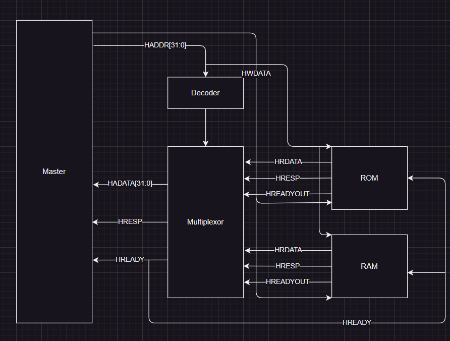
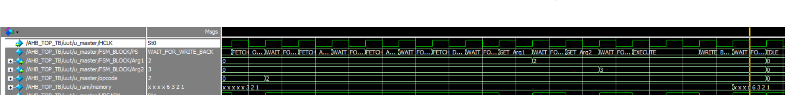

# Project Report: Milestone 3 Integration

### Table of Contents
1. [Introduction](#1-introduction)
2. [System Overview](#2-system-overview)
3. [Integration and Testing](#3-integration-and-testing)
4. [What I Learned and Improvements](#4-what-i-learned-and-improvements)
5. [Unsupported Features](#5-unsupported-features)
6. [Conclusion](#6-conclusion)

---

### 1. **Introduction**
   - **Submitted by**: Amr Hossam  
   - **GitHub Repo**: [GitHub Repo Link](https://github.com/amrhossam9/ADI_Assignments)  
   - This milestone focused on the design, integration, and testing of an **AHB-Lite** system featuring a master module, RAM, ROM, decoder, and MUX. The goal was to establish a working AHB-Lite bus system capable of interfacing with RAM and ROM efficiently using address-based decoding and data routing.

---

### 2. **System Overview**
   - The **AHB_TOP module** serves as the central integration block for all system components: the master, decoder, MUX, RAM, and ROM.
   - **Operation**: The system executes read/write operations, directing transactions to RAM or ROM based on address decoding.
   - **MUX**: Facilitates dynamic routing of data and response signals between RAM/ROM and the master, depending on the selected memory.

   **Block Diagram**  
   

---

### 3. **Integration and Testing**
   - **Decoder**: Manages address decoding, ensuring that the correct memory block (RAM/ROM) is selected based on the higher-order address bits.
   - **MUX**: Routes the appropriate data and control signals (HREADY, HRESP) to the master, depending on the selected memory.
   - **Master**: Drives read and write transactions through AHB-Lite compliant signals, handling the interactions with the memory blocks.

#### Testing Methodology:
   - **Testbench**: Testbench was created to validate the master’s ability to interface with RAM and ROM through the AHB-Lite bus.
   - **Waveform Analysis**: Used to visually verify data transfers, memory selections, and signal transitions.

   **Waveform Capture**  
   

---

### 4. **What I Learned and Improvements**
   - **Design Flow**: Initially, my design approach wasn’t ideal. Moving forward, I would focus on planning the entire design before starting implementation to avoid issues in later stages.
   
---

### 5. **Unsupported Features**
   - Multilayer AHB-Lite
   - Protection (HPROT)
   - Master lock (HMASTLOCK)
   - WRAP4, INCR4, WRAP8, INCR8 support for HBURST

---

### 6. **Conclusion**
   - **Milestone Achieved**: The project successfully integrates RAM and ROM into a functional AHB-Lite system, with complete verification through waveform analysis.

---