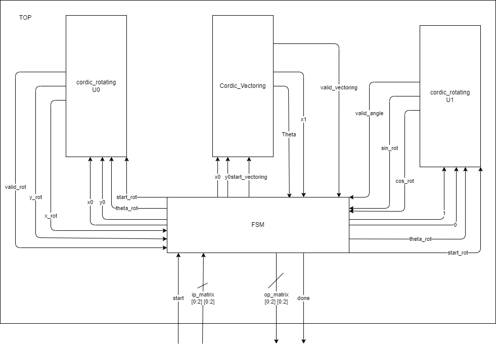
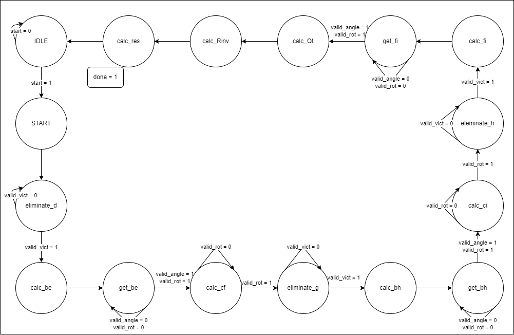
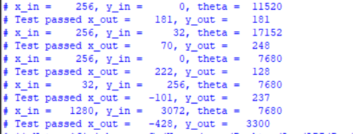
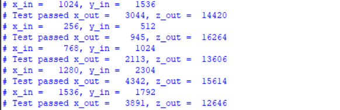
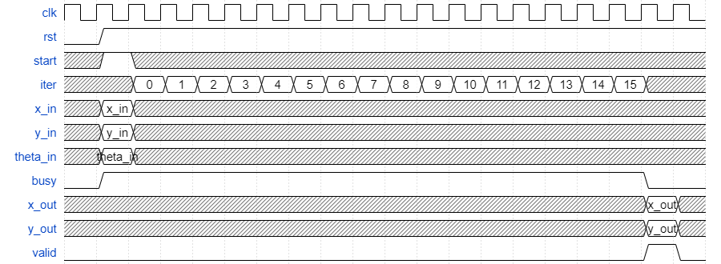
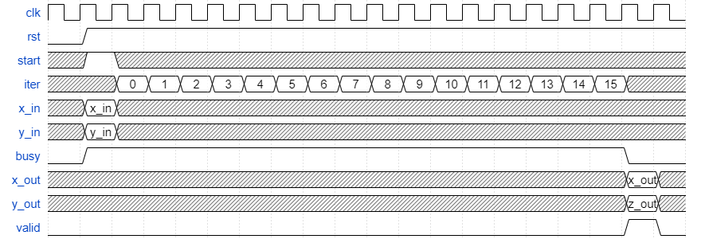
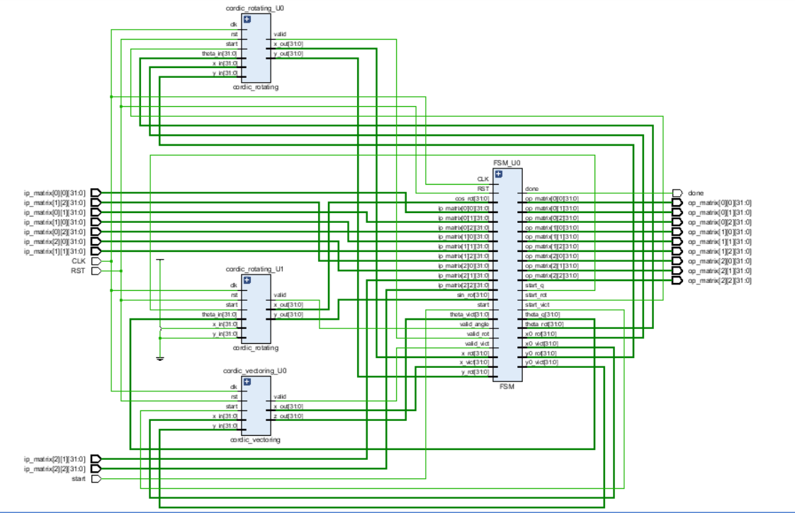

# Internship Final Project <br>Matric inversion using QR decomposition
# Name: Amr Hossam Mohamed Younes

## Table of Contents
1. [Project Overview](#project-overview)
2. [System Architecture](#system-architecture)
3. [Modules](#modules)
   - [Module 1: cordic rotating](#module-1-cordic-rotating)
   - [Module 2: cordic vectoring](#module-2-cordic-vectoring)
   - [Module 3: FSM](#module-3-fsm)
4. [Testbenches](#testbenches)
   - [Testbench for cordic_rotating](#testbench-for-cordic-rotational-module)
   - [Testbench for cordic_vectoring](#testbench-for-cordic-vectoring-module)
   - [Top Module Testbench](#top-module-testbench)
5. [Timing Diagrams](#timing-diagrams)
6. [Bitstream Generation for FPGA](#Bitstream-Generation-for-FPGA)

## Project Overview
3x3 Matric inversion block using QR decomposition implemented with CORDIC \
Target Board: Zynq UltraScale+ MPSoC ZCU104 Evaluation Kit

## System Architecture


## Modules
### Module 1: `cordic rotating`

#### Description:
 - The `cordic_rotating` module implements the CORDIC (COordinate Rotation DIgital Computer) algorithm to perform vector rotations. The CORDIC algorithm is an iterative method for computing trigonometric functions, vector magnitude, and rotations using only shift-add operations. This module takes a fixed-point input vector and an angle, rotates the vector by the given angle, and outputs the resulting vector.

#### Inputs:
- `clk`: Clock signal to synchronize the operations.
- `rst`: Active-low reset signal. When asserted, the internal registers are reset.
- `start`: A signal to initiate the CORDIC rotation operation.
- `x_in`: Signed input value representing the X component of the vector in fixed-point format.
- `y_in`: Signed input value representing the Y component of the vector in fixed-point format.
- `theta_in`: Signed input value representing the rotation angle (in radians) in fixed-point format.

#### Outputs:
- `valid`: Indicates when the output values are valid after the CORDIC operation.
- `x_out`: Signed output value representing the X component of the rotated vector in fixed-point format.
- `y_out`: Signed output value representing the Y component of the rotated vector in fixed-point format.

#### Functionality:

   - The CORDIC algorithm updates the intermediate values of the vector (`x_reg`, `y_reg`) and the angle (`z_reg`) over a series of iterations. In each iteration, the direction of the rotation is determined based on the sign of `z_reg`:
   
   - If `z_reg` is positive, the module performs a clockwise rotation of the vector.
   - If `z_reg` is negative, the module performs a counterclockwise rotation.
   
   - The values of `x_reg` and `y_reg` are adjusted by shifting and adding or subtracting them, which corresponds to multiplying by a power of two (a computationally efficient operation). The angle `z_reg` is adjusted by subtracting or adding precomputed arctangent values from the lookup table (`atan_table`).

   - Through this iterative process, the module gradually updates the vector's X and Y components, effectively rotating it closer to the final direction defined by the input angle `theta_in`.

### Module 2: `cordic vectoring`

#### Description:
 - The `cordic_vectoring` module implements the CORDIC (COordinate Rotation DIgital Computer) algorithm in vectoring mode, which is used to compute the magnitude and angle (theta) of a given 2D vector. The CORDIC algorithm is an iterative method that uses only shift-add operations to efficiently calculate trigonometric functions, magnitudes, and angles. This module takes a 2D vector as input and outputs the magnitude and angle of the vector.

#### Inputs:
- `clk`: Clock signal to synchronize the operations.
- `rst`: Active-low reset signal. When asserted, the internal registers are reset.
- `start`: A signal to initiate the CORDIC vectoring operation.
- `x_in`: Signed input value representing the X component of the vector in fixed-point format.
- `y_in`: Signed input value representing the Y component of the vector in fixed-point format.

#### Outputs:
- `valid`: Indicates when the output values are valid after the CORDIC operation.
- `x_out`: Signed output value representing the magnitude of the vector (normalized by the CORDIC gain) in fixed-point format.
- `z_out`: Signed output value representing the angle (theta) of the vector in fixed-point format.

#### Functionality:

   - The CORDIC algorithm iteratively updates the intermediate values of the vector's X and Y components (`x_reg`, `y_reg`) and calculates the angle (`z_reg`) over several iterations. The objective is to rotate the vector towards the X-axis, obtaining its magnitude in `x_out` and the angle in `z_out`.

   - In each iteration, the direction of rotation is determined by the sign of `y_reg`:
   
     - If `y_reg` is positive, the module performs a clockwise rotation.
     - If `y_reg` is negative, the module performs a counterclockwise rotation.
   
   - The values of `x_reg` and `y_reg` are adjusted by shifting and adding/subtracting them (similar to multiplication by a power of two), while the angle `z_reg` is updated by adding or subtracting precomputed arctangent values from the lookup table (`atan_table`).

   - After completing the specified number of iterations, the final value of `x_reg` is scaled to obtain the magnitude of the input vector in `x_out`, and `z_reg` represents the angle of the vector in `z_out`.

   - The `valid` signal is asserted when the outputs are ready, indicating the completion of the CORDIC vectoring operation.

### Module 3: `FSM`
The `FSM (Finite State Machine)` module presented here is designed to control the matrix computation.



#### Inputs:

- **Inputs**: The FSM receives signals like `x_vict`, `theta_vict`, `valid_vict`, `x_rot`, `y_rot`, and `valid_rot` for vector and rotational data. It also receives a 3x3 matrix (`ip_matrix`) as input.
- **Control Inputs**: `start` begins the FSM process, and `RST` and `CLK` handle resets and clock synchronization.

#### Outputs:

- **op_matrix**: The resulting matrix after all transformations.
- **done**: Signals when the FSM completes its task.
- Additional signals are generated to control the vector and rotation calculations (`start_vict`, `start_rot`, `start_q`), as well as intermediate variables for handling matrix elements and angles.

#### State Breakdown:

The FSM uses a state machine with 16 distinct states (encoded in 4 bits), each representing a step in the overall matrix computation:

1. **IDLE**: The initial and resting state where the FSM waits for the `start` signal. Once triggered, it initializes the input matrix `R` and moves to the next state (`START`).

2. **START**: Initiates the first stage of elimination, where vector elimination and matrix transformations begin. The first rotation uses the `a` and `d` elements of the matrix, and the FSM moves to `eliminate_d` to continue.

3. **eliminate_d**: In this state, the FSM processes vector data, transforming the first column (`a`, `d`) and calculates the new rotation angle `theta1`. After validation (`valid_vict`), it proceeds to the next calculation stage (`calc_be`).

4. **calc_be**: Computes the new matrix values for elements `b` and `e` using trigonometric rotations (`cos` and `sin` values). Once valid, the FSM moves to `get_be` to retrieve the calculated values.

5. **get_be**: Retrieves and stores the sine and cosine values of the first rotation and updates the matrix. It then calculates the next column values (`c`, `f`) in `calc_cf`.

6. **calc_cf**: Processes the `c` and `f` elements, performing another vector rotation. After validation, the FSM moves to eliminate the next matrix element (`eliminate_g`).

7. **eliminate_g**: The FSM eliminates the next element (`g`) using vector data and updates the matrix accordingly. It then transitions to the next stage (`calc_bh`).

8. **calc_bh**: The FSM computes the rotation for matrix elements `b` and `h`, updating the matrix. After validation, the FSM moves to retrieve the values (`get_bh`).

9. **get_bh**: Retrieves and stores the sine and cosine values for the second rotation. It prepares to calculate the next column elements (`c`, `i`) in `calc_ci`.

10. **calc_ci**: Processes the `c` and `i` elements. After the rotation is complete, the FSM proceeds to eliminate the next element (`eliminate_h`).

11. **eliminate_h**: The FSM eliminates the matrix element `h` using vector data. After validation, it transitions to the next stage to calculate `f` and `i` values (`calc_fi`).

12. **calc_fi**: Computes the next column values (`f`, `i`) using trigonometric calculations. After validation, it retrieves the sine and cosine values in `get_fi`.

13. **get_fi**: Retrieves and stores the sine and cosine values for the final rotation, updating the matrix. The FSM is now ready to calculate the final `Q_t` matrix in `calc_Qt`.

14. **calc_Qt**: Calls the `Qt()` function to calculate the orthogonal matrix \( Q_t \). Once complete, the FSM moves to `calc_Rinv`.

15. **calc_Rinv**: Computes the inverse of matrix \( R \) by calling the `c_Rinv()` function. This is essential for final result calculation.

16. **calc_res**: Once \( R_inv \) is computed, the FSM signals completion by setting `done = 1` and proceeds to output the final result.

#### Functions for Matrix Operations:

- **Qt()**: Computes the orthogonal matrix \( Q_t \) using sine and cosine values from the rotations.
- **c_Rinv()**: Calculates the inverse of the upper triangular matrix \( R \), essential for final matrix inversion.
- **Result()**: Calculates the result of multiplication R inverse with Q transposed.

### Testbenches

### Testbench for CORDIC Rotational Module
- **Description**: 
  This testbench verifies the functionality of the CORDIC rotational module by calculating the expected outputs (rotated coordinates) using a Python script. The script generates scaled inputs and outputs based on known mathematical transformations, specifically rotation. These values are then applied to the Verilog testbench for simulation, where the actual outputs are compared with the expected results. The test cases cover a variety of angles and input coordinates.
  
- **Code**:
  Here's an example of how the input/output was generated using Python:
  ```python
  import math
  import numpy as np

  def _calc(x, y, theta):
      theta = math.radians(theta)
      x_new = x * np.cos(theta) - y * np.sin(theta)
      y_new = x * np.sin(theta) + y * np.cos(theta)
      return x_new, y_new

  def _test(x, y, theta, scaling=8):
      x_new, y_new = _calc(x, y, theta)
      x_scaled = x * 2**scaling
      y_scaled = y * 2**scaling
      theta_scaled = theta * 2**scaling
      x_new_scaled = x_new * 2**scaling
      y_new_scaled = y_new * 2**scaling

      print(f"test('d{int(x_scaled)}, 'd{int(y_scaled)}, 'd{int(theta_scaled)}); // x = {x}, y = {y}, theta = {theta}")
      print(f"checkout('d{int(x_new_scaled)}, 'd{int(y_new_scaled)}, 'd{int((2**scaling) * 0.001)}); // x_n = {x_new}, y_n = {y_new}")

  # Test cases
  _test(1, 0, 45)
  _test(1, 0, 30)
  _test(1, 0, 60)
  ```

- **Testbench Verilog Code**:  
  The corresponding Verilog testbench incorporates these generated inputs and expected outputs into the simulation. For example:
  ```verilog
   test('d256, 'd0, 'd11520); // x = 1, y = 0, theta = 45
   checkout('d181, 'd181, 'd10); // Expected x_n = 0.707, y_n = 0.707
   ...
  ```

- **Screenshot of Passing Simulation**:  
  


### Testbench for CORDIC Vectoring Module
- **Description**: 
  This testbench verifies the CORDIC vectoring module, which calculates the magnitude and angle of a vector. The Python script is used to generate the expected outputs by computing the magnitude and angle using mathematical formulas and scaling them appropriately. The test cases cover various input vectors, ensuring the module handles edge cases (e.g., zero vectors).
  
- **Code**:
  Here's an example of how the input/output was generated using Python:
  ```python
  import math
  import numpy as np

  def _calc(x, y):
      if x == 0:
          if y > 0:
              theta = 90
          elif y < 0:
              theta = -90
          else:
              theta = 0
          x_new = abs(y)
      else:
          x_new = math.sqrt(x**2 + y**2)
          theta = math.degrees(math.atan2(y, x))
      return x_new, theta

  def _test(x, y, scaling=8):
      x_new, theta = _calc(x, y)
      x_scaled = x * 2**scaling
      y_scaled = y * 2**scaling
      x_new_scaled = x_new * 2**scaling
      theta_scaled = theta * 2**scaling

      print(f"test('d{int(x_scaled)}, 'd{int(y_scaled)}); // x = {x}, y = {y}")
      print(f"checkout('d{int(x_new_scaled)}, 'd{int(theta_scaled)}, 'd{int((2**scaling) * 0.001)}); // x_n = {x_new}, theta = {theta}")

  # Test cases
  _test(4, 6)
  _test(1, 2)
  ```

- **Testbench Verilog Code**:  
  Example of the Verilog code using generated values:
  ```verilog
   test('d1024, 'd1536); // x = 4, y = 6
   checkout('d1846, 'd14415, 'd10); // x_n = 7.211102550927978, theta = 56.309932474020215
   ...
  ```

- **Screenshot of Passing Simulation**:  
  


### Top Module Testbench
- **Description**: 
  The top module testbench combines both rotational and vectoring modules, verifying the entire CORDIC system. Inputs are provided, and the expected outputs are calculated using an online tool, such as the matrix calculator, for validation. The testbench ensures that the combined functionality of the system behaves correctly.
  
- **Code**:
  The inputs and outputs were cross-verified using an online tool, such as this [matrix calculator](https://matrix.reshish.com/):
  - Inputs: A matrix
  - Expected Outputs: Matrix inversion results
  
- **Testbench Verilog Code**:  
  An example of the Verilog testbench:
  ```verilog
   ip_matrix_TB[0][0] = 256;
   ip_matrix_TB[0][1] = 256;
   ip_matrix_TB[0][2] = 256;
   ip_matrix_TB[1][0] = 0;
   ip_matrix_TB[1][1] = 256;
   ip_matrix_TB[1][2] = 256;
   ip_matrix_TB[2][0] = 256;
   ip_matrix_TB[2][1] = 256;
   ip_matrix_TB[2][2] = 0;

   op_tmp[0][0] = 256;
   op_tmp[0][1] = -256;
   op_tmp[0][2] = 0;
   op_tmp[1][0] = -256;
   op_tmp[1][1] = 256;
   op_tmp[1][2] = 256;
   op_tmp[2][0] = 256;
   op_tmp[2][1] = 0;
   op_tmp[2][2] = -256;

   checkout(op_tmp, 10);
   ...
  ```

---

## Timing Diagrams
   ### cordic_rotating
   

   ### cordic_vectoring
   


## Bitstream Generation for FPGA
  - Target Frequency: 150 MHz
  - Target Board: Zynq UltraScale+ MPSoC ZCU104 Evaluation Kit
  - Successfully generated the bitstream for the ZCU104 board to meet the 150 MHz design target.
  - Total chip power: 0.592 W
  ### Schematic Design
  