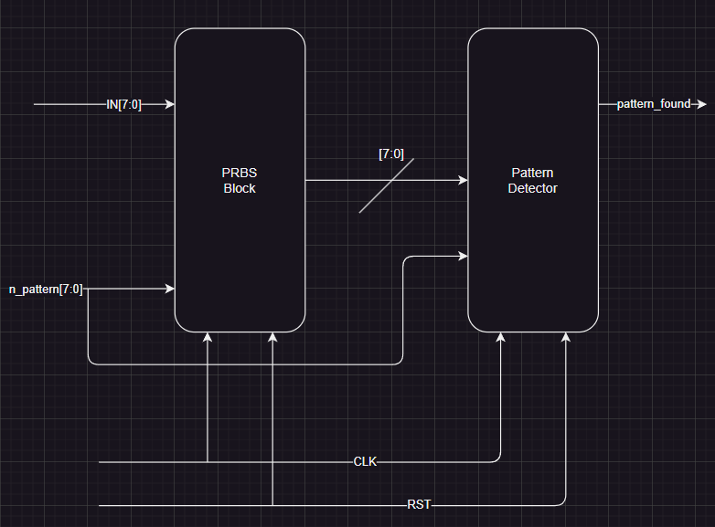
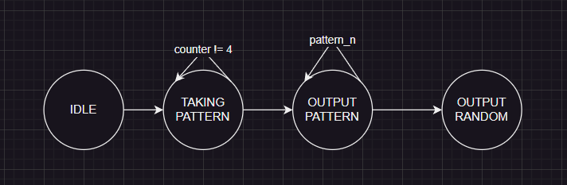
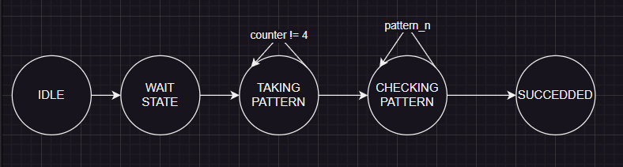
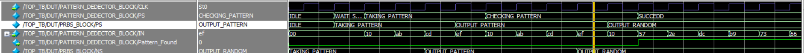

# PRBS Documentation  
## **Submitted by:** Amr Hossam  

## Table of Contents  
- [Introduction](#introduction)  
- [Block Diagrams](#block-diagrams)  
- [PRBS Design](#prbs-design)  
- [Pattern Detector Design](#pattern-detector-design)  
- [Testbenches](#testbenches)  

---

## Introduction  
This document describes the design and implementation of a **Pseudo-Random Binary Sequence (PRBS) Generator** and a **Pattern Detector**. Implemented in Verilog. The PRBS block is to generate a pseudo-random sequence following a user-specified pattern for n times, while the Pattern Detector block verifies that the sequence has been correctly transmitted.

---

## Block Diagrams  
### Overall System  
The system consists of two main blocks:  
1. **PRBS Generator**  
2. **Pattern Detector**

- **System Diagram:**
  

### PRBS Block  
This block generates a pseudo-random sequence based on a 4-byte input pattern and a PRBS-15 algorithm.

### Pattern Detector Block  
The Pattern Detector monitors the output of the PRBS block to ensure that the correct pattern is detected n times.

---

## PRBS Design  
### Inputs and Outputs  
- **Inputs:**
  - `IN [7:0]`: 8-bit input data.
  - `CLK`: Clock signal.
  - `RST`: Reset signal.
  - `n_pattern [7:0]`: Number of times the pattern is repeated.
  
- **Outputs:**
  - `out [7:0]`: Output of either the pattern or the pseudo-random sequence.

### State Machine  
The PRBS block uses a finite state machine (FSM) with the following states:
  

1. **IDLE**  
   - Resets and initializes internal registers.  

2. **TAKING_BYTES**  
   - Receives the 4-byte input pattern, byte by byte, and stores it in a shift register.

3. **OUTPUT_PATTERN**  
   - Outputs the stored pattern for `n_pattern` repetitions.

4. **OUTPUT_RANDOM**  
   - Generates a PRBS-15 sequence by shifting and XORing certain bits.

---

## Pattern Detector Design  

### Inputs and Outputs  
- **Inputs:**
  - PRBS output stream for detection.
  - n_pattern [7:0]: Number of times the pattern is repeated
  - Control signals (clock, reset, etc.).

- **Outputs:**
  - Flag indicating the detection of the correct pattern.

### State Machine  
The Pattern Detector FSM includes the following states:

1. **IDLE**  
   - Waits for the PRBS generator to begin outputting data.

2. **WAIT_STATE**  
   - Delay one clock cycle until the PRBS start operate.

3. **TAKING_PATTERN**  
   - Receives pattern for first time and stores it.

4. **CHECKING_PATTERN**  
   - Checking that the pattern came in the previous stage is correct.

3. **SUCCEDDED**  
   - The pattern came N-Times and the output flag will be equal 1.

---

## Testbenches  
The testbenches verify the functionality of both the PRBS and Pattern Detector blocks and top module:

1. **PRBS Testbench:**  
   - Verifies the correct reception and output of the 4-byte input pattern.
   - Ensures the PRBS block generates the correct pseudo-random sequence after the pattern output.

2. **Pattern Detector Testbench:**  
   - Confirms the detection of the pattern.
   - Confirms it doesn't work with wrong input.
   - Ensures the flag is raised after `n_pattern` repetitions.

Sample waveform:  
- **Waveform Example:**
  

