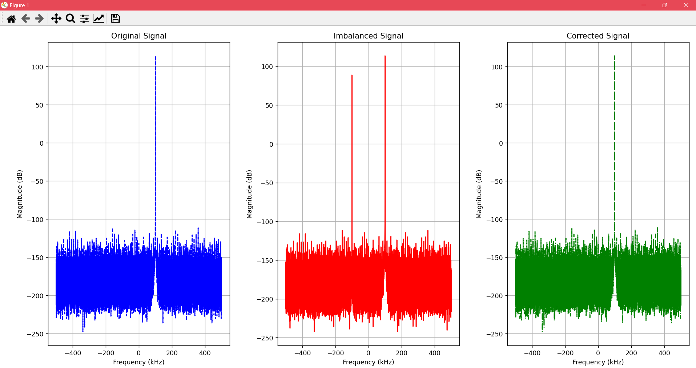

# RX IQ Imbalance Simulation and QEC Algorithm

`Submitted by:` Amr Hossam

## Overview
Simulate RX IQ imbalance and perform QEC algorithm 

## Code Description

### Generating the Single-Tone Signal
```python
# Generate single-tone signal (baseband)
z_I = np.cos(2 * np.pi * f_signal * t)  # In-phase component
z_Q = np.sin(2 * np.pi * f_signal * t)  # Quadrature component

# Original complex signal (without imbalance)
z_original = z_I + 1j * z_Q
```

### Applying IQ Imbalance
```python
# Assuming the values for g and phi to achieve -25 dB image rejection
g = 0.94  # Gain imbalance
phi = np.radians(5.5)  # Phase imbalance (5 degrees)

# Apply imbalance
z_I_prime = z_I  # In-phase component remains unchanged
z_Q_prime = g * (np.cos(phi) * z_Q - np.sin(phi) * z_I)  # Quadrature component is imbalanced

# Imbalanced complex signal
z_prime = z_I_prime + 1j * z_Q_prime
```
<br>
<br>
<br>
<br>
<br>
<br>
<br>
<br>
<br>
<br>
<br>
<br>

### QEC Algorithm
```python
## Estimate gain and phase
g_est = np.sqrt(np.sum(np.abs(z_Q_prime)**2) / np.sum(np.abs(z_I_prime)**2))
phi_est = np.sum(z_I_prime * z_Q_prime) / np.sqrt(np.sum(np.abs(z_I_prime)**2) * np.sum(np.abs(z_Q_prime)**2))

# Correct the imbalance
z_I_corrected = z_I_prime
z_Q_corrected = np.tan(phi) * z_I_prime +  (1 / (g * np.cos(phi))) * z_Q_prime

# Corrected complex signal
z_corrected = z_I_corrected + 1j * z_Q_corrected
```

### Frequency Domain Analysis
```python
# Apply windowing to reduce spectral leakage (Hann window)
window = np.hanning(len(z_prime))

# Perform FFT for all signals to analyze frequency domain
Z_original = np.fft.fftshift(np.fft.fft(z_original * window))
Z_prime = np.fft.fftshift(np.fft.fft(z_prime * window))
Z_corrected = np.fft.fftshift(np.fft.fft(z_corrected * window))
frequencies = np.fft.fftshift(np.fft.fftfreq(len(t), 1/fs))

# Convert to dB scale
Z_original_dB = 20 * np.log10(np.abs(Z_original))
Z_prime_dB = 20 * np.log10(np.abs(Z_prime))
Z_corrected_dB = 20 * np.log10(np.abs(Z_corrected))
```

<br>
<br>
<br>
<br>
<br>
<br>
<br>
<br>
<br>
<br>
<br>
<br>
<br>
<br>
<br>
<br>


### Calculating Power and Image Rejection Ratio
```python
# Signal and image power in the imbalanced signal
signal_power = np.max(Z_prime_dB[frequencies >= 0])  # Power of the main signal (positive frequencies)
image_power = np.max(Z_prime_dB[frequencies < 0])  # Power of the image (negative frequencies)

# Calculate Image Rejection Ratio (IRR)
image_rejection_ratio = signal_power - image_power

# Signal and image power in the corrected signal
signal_power_corrected = np.max(Z_corrected_dB[frequencies >= 0])  # Power of the main signal (positive frequencies)
image_power_corrected = np.max(Z_corrected_dB[frequencies < 0])  # Power of the image (negative frequencies)

# Calculate Image Rejection Ratio (IRR) after correction
image_rejection_ratio_corrected = signal_power_corrected - image_power_corrected
```
### Testing
`Output:`
```python
Signal Power (dB) - Original: 113.9793914008264
Image Power (dB) - Original: -111.43439579462436
Signal Power (dB) - Imbalanced: 113.70482711867452
Image Power (dB) - Imbalanced: 88.84197676189173
Image Rejection Ratio (dB) - Imbalanced: 24.862850356782786
Signal Power (dB) - Corrected: 113.96938284883035
Image Power (dB) - Corrected: 87.60025747033427
Image Rejection Ratio (dB) - Corrected: 26.36912537849608
Applied Gain Imbalance (g): 0.94
Applied Phase Imbalance (phi in degrees): 5.5
Estimated Gain Imbalance (g_est): 0.9399999999999992
Estimated Phase Imbalance (phi_est in degrees): -5.491557103664237
```

`Graph:`
